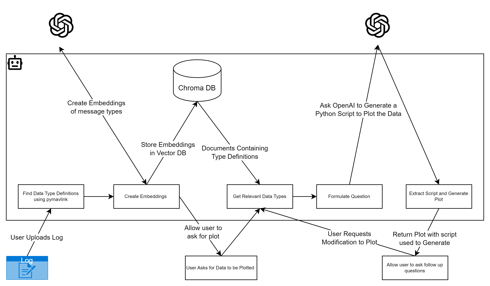

# MAVPlot

**A GPT-powered chatbot that turns natural language into drone flight plots.**

Upload a MAVLink `.tlog` file, describe the data you want to visualise, and MAVPlot will write a Python script using `pymavlink` + `matplotlib`, execute it in a **sandboxed environment**, and display the resulting plot — all inside a Gradio chat interface.



---

## How It Works

```
User uploads .tlog / .bin / .log file
        ↓
 validate_mavlink_file()  ←  extension, size, symlink, path-traversal checks
        ↓
 parse_mavlink_log()      ←  pymavlink reads all message types & fields
        ↓
 _create_embeddings()     ←  OpenAI text-embedding-3-small → persisted ChromaDB
        ↓
User sends a chat prompt  (e.g. "Plot altitude over time")
        ↓
 find_relevant_data_types()  ←  semantic search in ChromaDB
        ↓
 create_plot()  ←  GPT writes a pymavlink + matplotlib script (LCEL pipeline)
        ↓
 run_script()   ←  RestrictedPython sandbox (no subprocess, no os, no network)
        ↓
    Plot image returned to chat  +  generated code shown
```

If the generated script throws an error, `attempt_to_fix_script()` feeds the error back to GPT for up to **2 self-healing retries**.

---

## Features

- **Natural language → plot** — describe any flight data in plain English
- **Auto log parsing** — extracts all MAVLink message types and fields automatically
- **Semantic data type search** — vector embeddings find the most relevant fields for your query
- **Self-healing scripts** — GPT debugs and retries failed scripts automatically (up to 2×)
- **Sandboxed execution** — generated code runs in RestrictedPython; no shell access
- **File validation** — only `.tlog` / `.bin` / `.log` accepted; symlinks and path traversal blocked
- **Persisted vector store** — ChromaDB saved to disk; re-uploading won't re-embed
- **Code transparency** — the generated Python script is shown alongside every plot
- **Progress bar** — real-time progress during parsing and generation
- **Status indicator** — live chip shows idle / uploading / ready / thinking / error
- **Reset button** — clear session and start fresh without a page reload
- **Gradio 4.x UI** — modern chat interface with copy button and streaming output
- **Configurable model** — swap GPT models via the `.env` file

---

## Tech Stack

| Layer | Technology |
|---|---|
| UI | Gradio ≥ 4.0 |
| LLM | OpenAI GPT via `langchain-openai` (LCEL) |
| Embeddings | OpenAI `text-embedding-3-small` |
| Vector Store | ChromaDB ≥ 0.5 (persisted) |
| Sandbox | RestrictedPython 7.1 |
| Drone Log Parsing | pymavlink 2.4.37 |
| Plotting | matplotlib 3.7.1 |
| Config | python-dotenv |

---

## Project Structure

```
MAVPlot/
├── app.py                      # Gradio 4.x UI and chat event handlers
├── llm/
│   ├── gptPlotCreator.py       # PlotCreator — core LLM + plotting logic (LCEL)
│   ├── safe_executor.py        # RestrictedPython sandbox for generated scripts
│   └── file_validator.py       # Upload validation (extension, size, symlink)
├── tests/
│   ├── test_extract_code_snippets.py
│   ├── test_file_validator.py
│   └── test_safe_executor.py
├── .github/
│   └── workflows/
│       └── ci.yml              # GitHub Actions: lint (ruff) + pytest on push
├── docs/
│   └── GPT_MAVPlot_Arch.png
├── target/                     # Output directory for plot.py and plot.png
├── chroma_db/                  # Persisted ChromaDB vector store (git-ignored)
├── template.env                # Environment variable template
├── requirements.txt            # Python dependencies
└── LICENSE
```

---

## Prerequisites

- Python **3.10+**
- An **OpenAI API key** — [get one here](https://platform.openai.com/api-keys)

---

## Setup

**1. Clone the repo**
```bash
git clone https://github.com/AyushMaria/MAVPlot.git
cd MAVPlot
```

**2. Create and activate a virtual environment**
```bash
python -m venv venv

# macOS / Linux
source venv/bin/activate

# Windows
venv\Scripts\activate
```

**3. Install dependencies**
```bash
pip install -r requirements.txt
```

**4. Configure environment variables**

Copy `template.env` to `.env` and add your OpenAI API key:
```bash
cp template.env .env
```

```env
OPENAI_API_KEY=sk-your-openai-api-key-here
OPENAI_MODEL=gpt-3.5-turbo   # or gpt-4, gpt-4o
```

> ⚠️ Never commit your `.env` file — it is listed in `.gitignore`.

**5. Run the app**
```bash
python app.py
```

Open the Gradio URL shown in the terminal (usually `http://127.0.0.1:7860`).

---

## Usage

1. Click **📁** and upload a MAVLink `.tlog`, `.bin`, or `.log` file
2. Wait for the progress bar — MAVPlot parses the log and builds a vector index
3. Type a plot request, for example:
   - `Plot altitude over time`
   - `Show GPS latitude and longitude`
   - `Plot battery voltage and current`
4. MAVPlot will find relevant fields, generate a script, run it in a sandbox, and show the plot + code
5. Click **🔄 Reset session** to start fresh with a new log file

> **Need a sample log file?**  
> [Download here](https://drive.google.com/file/d/1BKv-NbSvYQz9XqqmyOyOhe3o4PAFDyZa/view?usp=sharing)

---

## Running Tests

```bash
pip install pytest pytest-cov ruff
pytest tests/ -v --cov=llm
```

To lint:
```bash
ruff check llm/ app.py
```

---

## PlotCreator Class

The core logic lives in `llm/gptPlotCreator.py`:

| Method | Description |
|---|---|
| `parse_mavlink_log()` | Reads `.tlog`, extracts all message types and field names |
| `_create_embeddings()` | Embeds each message type into a persisted ChromaDB vector store |
| `find_relevant_data_types()` | Semantic similarity search to find fields matching the user query |
| `create_plot()` | Calls GPT via LCEL to generate a `pymavlink` + `matplotlib` script |
| `run_script()` | Executes the script in the RestrictedPython sandbox |
| `attempt_to_fix_script()` | Feeds errors back to GPT for automatic script debugging |

---

## Troubleshooting

| Issue | Cause | Fix |
|---|---|---|
| `AuthenticationError` | Invalid or missing OpenAI API key | Check `.env` has the correct `OPENAI_API_KEY` |
| `ModuleNotFoundError` | Missing dependency | Run `pip install -r requirements.txt` in your venv |
| `ImportError: RestrictedPython` | Package not installed | `pip install RestrictedPython==7.1` |
| Plot not generated after 2 retries | GPT script failed twice | Try a more specific prompt; check the log is a valid `.tlog` |
| `FileValidationError` | Wrong file type or empty file | Only `.tlog`, `.bin`, `.log` are accepted |
| ChromaDB version conflict | Dependency mismatch | Use a fresh `venv` with `pip install -r requirements.txt` |

---

## License

MIT — see [LICENSE](LICENSE) for details.
